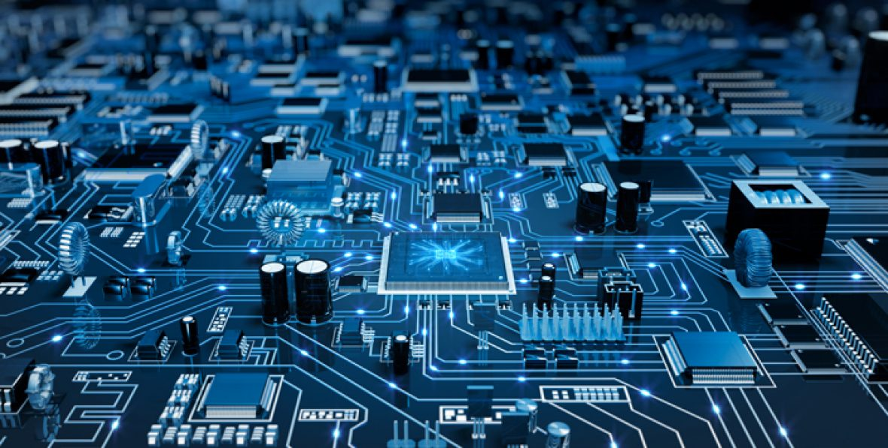

# Digital-System-Design-Lab

  
    

 

## Course Overview

The Digital System Design Lab is a hands-on course focused on designing, simulating, and implementing digital systems using Verilog. Students will learn to create synthesizable Verilog code, simulating their designs, and implement them on FPGA platforms. This course bridges theoretical knowledge and practical skills essential for a career in digital system design. You can download lab manual from [here](https://github.com/foratik/Digital-System-Design-Lab/blob/main/DSD-Lab.pdf). 

## Instructors
- Dr. Mohsen Ansari
- Mr. MohammadReza Hosseini

## Team Members:
- [Saeed Forati K.](https://github.com/foratik)
- [Amirhossein Souri](https://github.com/Amir14Souri)
- [MohammadAmin Abbasfar](https://github.com/M-Amin-A)

## Board And FPGA:
### Altera DE2 Board

  
    

 

### Pin Table

You can download the high quality image from [here](https://github.com/foratik/Digital-System-Design-Lab/blob/main/Pin%20Table.png).

  
    

 
